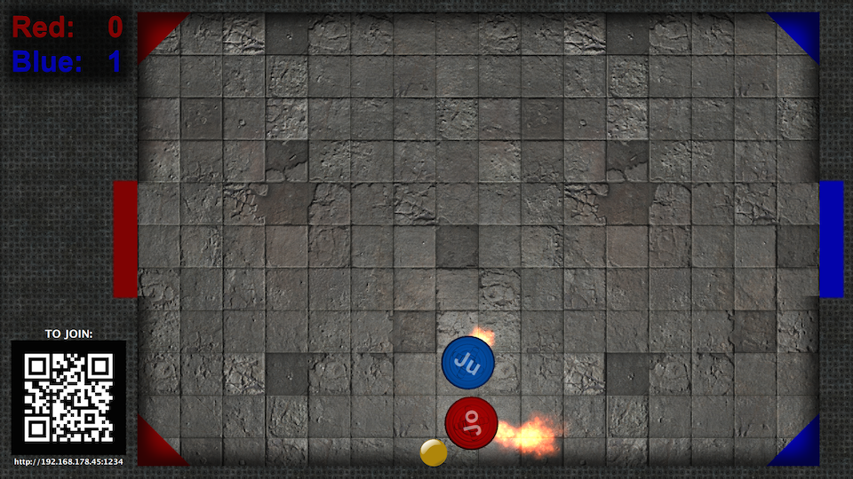
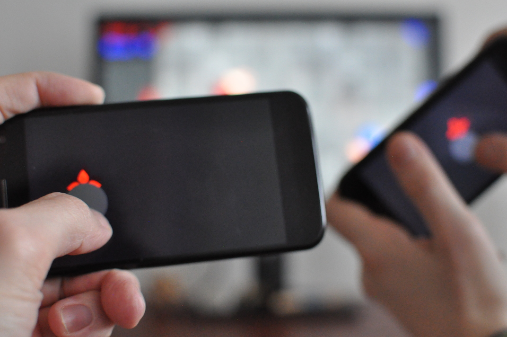

touchockey
==========

This is a shared screen multiplayer hockey game allowing you to play on local network with your friends using your mobile phone as game controller.

Comments are welcome on [Google+](https://plus.google.com/111347271351455592833/posts/UHrhH6WdGsk) and [Twitter](https://twitter.com/jocesaying/status/559394373138649088)




To play
-------
- Make sure that all client phones are on the same WiFi network.
- Scan the QR Code with a phone or enter the shown HTTP address manually in the web browser.
- Enter your name and then move your fingers on the phone screen, the player on the computer screen will follow the movements. Move your fingers quickly to make the player move faster.

The goal of the game is to push the puck in the blue goal if you are red, or vice-versa. Points are shown but the game never ends.

There is no limit to the number or players that can join, but I didn't try more than 6.

Install
-------
[Binaries](https://github.com/jturcotte/touchockey/releases) are available for OSX and Windows, install vcredist_x86.exe if you get a missing MSVCR120.dll error on Windows.

To build from sources
---------------------
External dependencies:
- Qt >=5.3
- libqrencode

```
git submodule update --init
qmake && make
```

Known issues
------------
- There is no frame rate adaptation of any sort, so if your computer can't get you v-synced 60fps it will feel horrible. Try reducing the resolution or the size of the window otherwise.
- The IP address in the QRCode is wrong on Windows Vista and 7. Please use the displayed URL, replacing the IP address with the one reported by the network adapter status instead.

Implementation details
----------------------
A small HTTP server embedded in the game lets players connect using their phone's browser and fetch an HTML game controller UI that sends touch events back to the game through a WebSocket.

The graphics are done using QtQuick and the physics with qml-box2d. Most of the game logic is done in QML, except for the bump mapping LightedImage item and the backend network server logic that are written in C++.

License
-------
The code is released under the MIT license.

Included or modified external components
----------------------------------------
- https://github.com/qml-box2d/qml-box2d
- https://github.com/yoneal/qtqrencode
- http://ikons.piotrkwiatkowski.co.uk
- http://quitcoding.com/?page=work#nmapper
- http://opengameart.org/content/ufo-saucer
- http://opengameart.org/content/metalstone-textures
- http://nobiax.deviantart.com/art/Free-textures-pack-48-376962074
